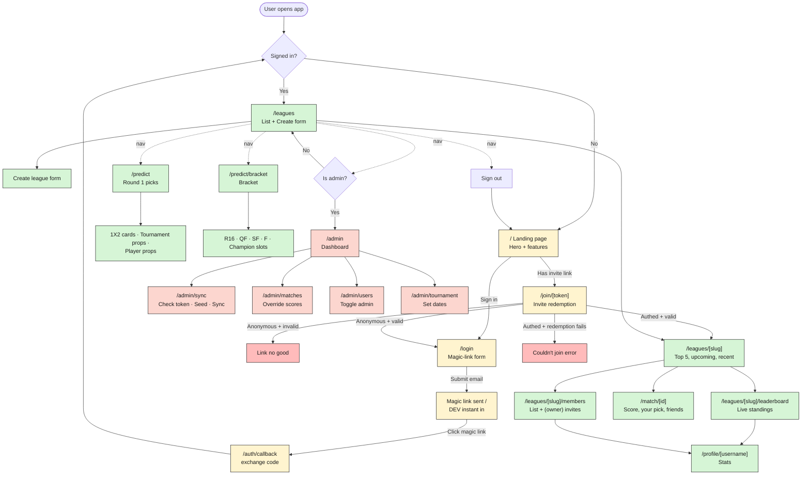

# User Journeys — QA test map

A complete map of every flow a user can drive through the Kickoff '26 portal,
intended as a QA checklist. Every numbered journey is a discrete test scenario;
every bullet is a step the tester executes or an outcome to verify.

For source-of-truth on individual pages, see the file references next to each
journey heading (`app/<path>:line`).

---

## Roles

| Role | Definition | How to set up for testing |
| --- | --- | --- |
| **Anonymous** | No Supabase session cookie | Open in a private/incognito window |
| **Member** | Authenticated, in at least one league, `profiles.is_admin = false` | Sign in via magic link or invite |
| **Owner** | Member who created a league (`leagues.owner_id = auth.uid()`) | Create a league via `/leagues` |
| **Admin** | `profiles.is_admin = true` | `update profiles set is_admin = true where username = '...'` |

Each Member is also a viewer of every league they belong to — Owner permissions
are league-scoped, not global.

## Lock states (gates the prediction UI)

| State | Trigger | Effect |
| --- | --- | --- |
| `round1Locked` | `now >= tournament.first_kickoff_at` | Round 1 (1X2 + tournament props) is read-only |
| `round2Locked` | `now >= tournament.knockout_start_at` | Bracket is read-only |
| `matchIsLocked` | `now >= matches.kickoff_at` for a single match | That match's row becomes read-only; friends' picks become visible on `/match/[id]` |

Locks are computed in `lib/scoring/lock.ts`. Server actions in
`lib/predictions/actions.ts` also enforce them (returning
`{ ok: false, error: "Round 1 picks are locked." }`) so even a tampered client
cannot bypass.

---

## Visual map

---

## A — Anonymous user

### A1. Land on the marketing page  (`app/page.tsx`)
- Open `/` in an incognito window.
- Verify hero "Predict every match. BEAT your friends." renders.
- Verify the 5 sticker country flags carousel (ARG, BRA, ESP, FRA, GER) appears with the "T-MINUS 21 DAYS" badge.
- Verify the 4 feature cards (Round 1, Round 2, Private leagues, Live leaderboard).
- Click **"▶ Start the album"** → routes to `/login`.
- Click **"How it works"** → in-page anchor scrolls to `#how`.
- Click the top-right **"Sign in"** button → routes to `/login`.
- Footer "⚽ Stick · Predict · Score ⚽" visible on green-stripe pitch background.
- If you sign in then revisit `/`, you are auto-redirected to `/leagues`.

### A2. Land on a valid invite without an account  (`app/(auth)/join/[token]/page.tsx`)
- Open `/join/<valid-token>` in incognito.
- Verify badge "🎟 You've been invited" and headline "Join {league_name}".
- Verify preview `kickoff.app/j/<first 12 chars>` is rendered.
- Verify the login form is shown (with `inviteToken` baked in).
- Submit your email → magic link sent (or instant sign-in if DEV).
- After clicking the link, you should land on `/leagues/<slug>` of the inviting league.

### A3. Land on an invalid/expired/revoked invite
- Open `/join/<bad-token>` (e.g. random string, manually revoked token, expired token, exhausted token).
- Verify red badge "✕ Invite invalid" and headline "Link no good".
- Verify **Back home** button routes to `/`.
- The login form must NOT appear.

---

## B — Authentication

### B1. Sign in via magic link  (`app/(auth)/login/page.tsx`, `lib/auth/signIn.ts`)
- Open `/login` in incognito.
- Verify badge "No passwords · Magic link".
- Submit email → button label flips to **Sending…** then **✓ Magic link sent**.
- Verify the inline tip "We sent a link to <email>" appears with the typed address.
- Open the email; verify the link URL points to `/auth/callback?code=...`.
- Click the link → redirected to `/auth/callback` then to `/leagues`.
- Confirm Nav bar appears with **Round 1 / Bracket / Leagues** links.

### B2. Magic-link callback edge cases  (`app/auth/callback/route.ts`)
- Magic-link with no `code` param → redirects to `/login` (no error).
- Magic-link with invalid/expired `code` → redirects to `/login?error=<msg>` (verify the message is rendered if a UI surfaces it — currently it is in the URL only).
- Magic-link with `?invite=<token>` → after exchanging the code, bounces through `/join/<token>` to redeem; the user lands on the league or sees the error state.

### B3. Sign out  (`components/SignOutButton.tsx`)
- Authenticated, click **Sign out** in the Nav.
- Supabase `signOut()` is called, router refreshes, then pushes to `/`.
- Confirm visiting any `/leagues`, `/predict`, `/admin` URL now redirects to `/login`.

### B4. Authenticated user opens `/login` or `/`
- Both routes detect the session and redirect to `/leagues`.

---

## C — Leagues (member)

### C1. View leagues list  (`app/(app)/leagues/page.tsx`)
- Sign in. Navigate to `/leagues`.
- **Empty state**: zero memberships → card reads "You aren't in any leagues yet. Create one below, or open an invite link from a friend."
- **Populated state**: each membership renders as a card with badge "Owner" (if owner), description (if any), and "👥 N players" count.
- Click a league card → routes to `/leagues/<slug>`.
- Verify the "Create a league" section is always present at the bottom.

### C2. Create a league  (`CreateLeagueForm.tsx`, `lib/leagues/actions.ts:createLeague`)
- On `/leagues`, scroll to "Create a league".
- Submit blank → inline error "Name is required".
- Submit a name (and optional description) → button label flips to **Creating…**.
- On success: redirected to `/leagues/<slug>`; you are inserted as `role = 'owner'`.
- Edge case: slug collision is handled — the action retries up to 8 times with `<slug>-<randomToken(4)>` before giving up.
- Edge case: RLS visibility check — if the created league isn't readable back to the creator, the action rolls back the insert and shows "League created but not visible to you — likely a profile/RLS mismatch. Please contact an admin." Capture the Sentry event for diagnosis.

### C3. View a league home  (`app/(app)/leagues/[slug]/page.tsx`)
- Open `/leagues/<slug>`. Verify:
  - Badge "Private league", headline = league name, description (if any).
  - Two CTAs: **🏆 Leaderboard** → `/leagues/<slug>/leaderboard`, **👥 Members** → `/leagues/<slug>/members`.
  - **Top 5** section (`league_standings` ordered by `total_points`). Empty → "No points awarded yet…". Populated → numbered list 1–5 with gold/silver/bronze styled rank chips, names linking to `/profile/<username>`, total points right-aligned.
  - **Upcoming matches** card (up to 5 future matches). Empty → "No upcoming matches." Each row links to `/match/<id>`, shows both team crests, name, kickoff time.
  - **Recent results** card (up to 5 FINISHED matches), each with home–away score.
- Hit `/leagues/<unknown-slug>` → Next.js `notFound()` 404 page.

### C4. View members  (`app/(app)/leagues/[slug]/members/page.tsx`)
- Open `/leagues/<slug>/members`.
- Verify back link "← {league name}" and headline "Members" with "N players" subhead.
- Verify each member tile: avatar with initial, name link to `/profile/<username>`, "Owner" badge if applicable.
- **As a non-owner**: `InviteControls` MUST NOT render.

### C5. Owner — create an invite  (`InviteControls.tsx`, `lib/leagues/actions.ts:createInvite`)
- As the league owner, open `/leagues/<slug>/members`.
- Verify the **Invite links** card is present.
- Click **+ New invite** → button flips to "Creating…", and a new row appears at the top of the list.
- Verify defaults: `max_uses = 100`, `expires_at = now + 30 days`, `uses_count = 0`, `revoked = false`.
- The new row shows the full `https://<origin>/join/<token>` URL, a `0/100` counter, **Copy** and **Revoke** buttons.

### C6. Copy an invite URL
- Click **Copy** on an active invite. Verify the button label flips to **Copied** for 1.5 s.
- Paste somewhere — should be `https://<origin>/join/<token>`.

### C7. Revoke an invite
- Click **Revoke** on an active invite → button disabled while pending; on success the row gets `opacity-60` and a "Revoked" badge.
- Revoked invites no longer expose **Copy** / **Revoke** buttons.

### C8. Live leaderboard  (`app/(app)/leagues/[slug]/leaderboard/page.tsx`, `LeaderboardLive.tsx`)
- Open `/leagues/<slug>/leaderboard`.
- Verify back link "← {league name}", badge "The board", headline "Leaderboard".
- Empty state: "No points awarded yet. Predictions go live with the first match."
- Populated state: every row shows rank chip (1=gold, 2=paper, 3=coral), display name + `@username`, bracket points, props points, total points.
- **Highlight self**: your own row has a gold background + coral shadow + "← YOU" label.
- **Realtime update**: in another window, override a match result via `/admin/matches/<id>` or trigger `score_match`. Without refreshing, your row should reorder and points should update (Postgres Realtime channel `league:<id>:awards` listens for `INSERT` on `point_awards`).

### C9. Visit a profile  (`app/(app)/profile/[username]/page.tsx`)
- From any leaderboard or member list, click a username.
- Verify avatar tile (initial letter on gold background), display name, `@username`.
- Verify primary stats row: Points, Acc. 1X2 (%), Picks made, Picks correct.
- Verify secondary stats row: 1X2, Bracket, Tournament, Props point breakdowns.
- Verify the **Pick personality** card: a Home/Draw/Away pick-mix bar; three comparison bars (Group accuracy / Knockout accuracy / Bracket survival) — each shows "Not enough data yet" until matches kick off, then fills with your value over a hatched league-average track; and three tiles (Boldness %, Avg pick time, Upsets called). On your own profile it shows your full picks; on a league-mate's it shows their revealed picks once round 1 has locked; on a stranger's (no shared league) the card is absent.
- Unknown username → `notFound()` 404.

---

## D — Invite redemption

### D1. Anonymous → join via invite  (covered in A2 + B1)
- Verify the magic link sent from `/join/<token>` includes `?invite=<token>` so callback redirects to `/join/<token>` after auth.

### D2. Already-authenticated user opens an invite link
- Authenticated, open `/join/<valid-token>`.
- `validateInviteToken()` runs first; `consumeInviteForUser()` is then called automatically and you are redirected to `/leagues/<league_slug>` if success.

### D3. Authenticated user, invite consumption fails
- Force a failure (e.g. already a member of the league, RPC error, exhausted in another tab between validate and consume).
- Verify the page renders the "✕ Couldn't join" red badge with the error message, and a **Back to my leagues** button that routes to `/leagues`.
- Verify a Sentry event is captured with `area: "invite"` and `token_prefix`.

### D4. Authenticated user opens an invalid invite
- Verify the "Link no good" card renders with **Back home** button (same UI as A3).

---

## E — Round 1 predictions  (`app/(app)/predict/page.tsx`)

For each section below, verify the **locked** variant: when `tournament.first_kickoff_at` has passed, all inputs are `disabled` and tiles show the "Locked" badge. The server action also enforces this — even a hand-crafted POST receives `{ ok: false, error: "Round 1 picks are locked." }`.

### E1. View Round 1 page (unlocked)
- Navigate `/predict`.
- Verify hero badge "Round 1 · Group stage", "Stick your picks" headline.
- Verify `CountdownBanner` ticks down every second toward `first_kickoff_at`.
- If no fixtures have been seeded yet, the "Group stage — 1X2" section shows an empty-state card with the last `external_sync_log` row (or "No sync has run yet…" if none).

### E2. Make / change / clear a 1X2 pick  (`MatchPickCard.tsx`, `setMatchPick`)
- Tap the Home tile → it goes gold; the status pill flips from "Pick!" (coral) to "✓ Picked" (pitch).
- Tap Draw — Home should de-select and Draw should go gold.
- Tap the currently-selected tile a second time → the pick clears (server is called with the previous pick rolled back to null via optimistic update + server upsert; the row simply re-pings the same value, then a separate test should confirm tapping again removes the row).
- Network failure (DevTools offline) → tile reverts to previous state and an inline red error appears below the card.
- Verify in-page tally chip "**N** picked · **N** to go".

### E3. Group coverage chips
- Each of the 12 groups (A..L) renders a chip showing `<picked>/<total>` (e.g. `2/6`).
- When a group reaches `picked == total`, the chip turns pitch-green with a ✓ instead of the count.

### E4. Set tournament outcomes & player props  (`TournamentForm.tsx`)
Walk through every selector:
- **Tournament winner** — TeamSelect, no ranking sort. Pick a team → autosaves via `setTournamentPick({ winner_team_id })`.
- **Runner-up** — same as above with `runner_up_team_id`.
- **Dark horse** — TeamSelect with `showRanking`; teams sort by `fifa_ranking desc` and the option label reads `#<rank> — <name>`.
- **Golden boot — top scorer** — PlayerSelect.
- **Total goals (whole tournament)** — NumberInput, integer 0–300; out-of-range returns `{ ok: false, error: "Pick an integer between 0 and 300." }`.
- **Highest-scoring match goals** — NumberInput, integer 0–30; out-of-range returns the matching error.
- **First team eliminated** — TeamSelect.
- **Troublemaker** — PlayerSelect, writes to `player_prop_predictions(prop_key='troublemaker')`.
- **First goal in the Final** — PlayerSelect, writes to `player_prop_predictions(prop_key='first_goal_final')`.
- Verify optimistic update + rollback for each (force a network failure to test).

### E5. Locked Round 1
- After `first_kickoff_at`, reload `/predict`.
- All match cards show the **Locked** badge and tiles are disabled.
- All TournamentForm fields are disabled.
- CountdownBanner shows the red "⏰ Picks locked." pill.

---

## F — Round 2 (bracket) predictions  (`app/(app)/predict/bracket/page.tsx`)

### F1. View bracket page
- Navigate `/predict/bracket`.
- Verify hero badge "Round 2 · Knockouts", "Knockout bracket" headline.
- `CountdownBanner` ticks toward `tournament.knockout_start_at`, label "Bracket locks in".
- 5 column groups render in order: **Round of 16** (8 slots), **Quarter-finals** (4), **Semi-finals** (2), **Final** (1), **Champion** (1).

### F2. Fill a slot  (`BracketBuilder.tsx`, `setBracketPick`)
- Open a slot's `<select>` → all teams listed.
- Choose a team → the slot's card flips from dashed-border "?" empty-state to solid-border with the team flag + name.
- A small "✓" badge appears in the slot header.
- The Champion slot uses a gold shadow (instead of ink) when filled.
- Tap the select again, choose a different team → slot updates; the previous value is overwritten in `bracket_predictions`.

### F3. Bracket locked
- After `knockout_start_at`, all selects are disabled; each slot shows the "Locked" badge.
- Server action returns `{ ok: false, error: "Round 2 bracket is locked." }`.

> ⚠️ Progressive reveal (R16 → QF → SF → F derives from upstream) is NOT yet implemented. QA should not expect downstream slots to invalidate when an upstream pick changes. Tracked in `DESIGN_MISALIGNMENTS.md` §7.

---

## G — Match detail  (`app/(app)/match/[id]/page.tsx`)

### G1. View an upcoming match (not yet kicked off)
- Navigate `/match/<id>` for a match with `kickoff_at` in the future.
- Verify the header badge (`Group X` or stage e.g. `R16`), kickoff timestamp, status badge.
- Both team crests + 3-letter codes render side-by-side around a coral `vs`.
- "Your pick" card shows either your selected outcome (HOME/AWAY label = team code; DRAW label = "Draw") or "— not picked —".
- **League picks** section MUST NOT render before kickoff (RLS hides other users' picks).

### G2. View a locked match (kickoff passed, not finished)
- After `matchIsLocked(kickoff_at)`, friends' picks become visible.
- Verify the "League picks" section appears with:
  - 3 pick-stat tiles (Home / Draw / Away) showing absolute count and percentage. Home tile is gold, Draw is paper, Away is coral.
  - Below, a list of every league-mate with their pick badge.

### G3. Live match (`status = IN_PLAY` or `PAUSED`)
- Verify a red `● LIVE` badge appears.
- The whole card gets a coral shadow instead of ink.

### G4. Finished match
- Verify `Final` pitch-green badge, large score `<home> – <away>`, "League picks" section still present.

### G5. Unknown match id
- `/match/<bad-id>` → `notFound()` 404.

---

## H — Admin journeys  (`app/(app)/admin/*`)

Pre-req: `profiles.is_admin = true` for the test user. Non-admins hitting any `/admin/*` route are redirected to `/leagues`. Unauthenticated → redirected to `/login`.

### H1. Admin dashboard  (`app/(app)/admin/page.tsx`)
- Open `/admin`. Verify 4 cards: **Matches loaded**, **Finished**, **Scheduled**, **Latest scoring** (timestamp of last `point_awards` insert).
- Verify **Tournament window** lists `first_kickoff_at`, `knockout_start_at`, `final_at` and an **Edit dates →** link.
- Verify **Recent sync log** shows the last 10 `external_sync_log` rows.
- Admin sub-nav (Overview / Sync / Matches / Users / Tournament) is present at the top.

### H2. Sync controls  (`app/(app)/admin/sync/*`, `lib/admin/actions.ts`)
- Open `/admin/sync`. 4 buttons:
  - **Check token** → currently throws a deliberate `sentry-smoke-test` exception (TEMP diagnostic). Verify the run-log line begins with `error — sentry-smoke-test [dsn=… client=… runtime=… env=…]` and a Sentry event is captured.
  - **Seed teams + players** → calls `seedTeams()` (football-data.org `/teams`). Verify the run-log shows the row count and `external_sync_log` row appears.
  - **Sync fixtures + results** → calls `syncFixtures()`. Verify match upserts + idempotent scoring (re-run shouldn't duplicate `point_awards`).
  - **Sync scorers** → calls `syncScorers()`. Verify scorer table populates.
- Verify each row in the run-history scratchpad prefixes a timestamp.
- All 4 buttons are disabled while one is pending.

### H3. Matches list + override  (`app/(app)/admin/matches/*`)
- Open `/admin/matches`. Verify the table shows every match: When, Stage (+ group letter), Match (home vs away names), Status, Score, Edit link.
- Click **Edit →** for any match → routes to `/admin/matches/<id>`.
- The override form pre-fills `home_score` / `away_score`. Submit → button flips to **Saving…**, then green message "Saved and re-scored." appears.
- Negative scores or non-integers → inline error "Scores must be non-negative integers."
- After saving, verify:
  - `matches` row updated (status=FINISHED, winner derived from scores).
  - `score_match` RPC has been called → `point_awards` rows appear.
  - `score_bracket`, `score_tournament`, `refresh_league_standings` are also called (silently swallowing errors).
  - Idempotency: submit the same scores again → no new `point_awards` rows (deduped by `idempotency_key`).
  - The league leaderboard updates live within seconds (via realtime).

### H4. Users list + admin toggle  (`app/(app)/admin/users/*`)
- Open `/admin/users`. Verify the table lists every profile with username, display name, joined date, and the **Member / Admin** toggle button.
- Click a row's button → optimistic flip to "Admin" / "Member", then the server action persists. On error, the UI rolls back.
- Toggling yourself off MUST still succeed; the next navigation (or refresh) will redirect you away from `/admin/*`.

### H5. Tournament dates  (`app/(app)/admin/tournament/*`)
- Open `/admin/tournament`. Three datetime-local inputs: first kickoff, knockout start, final.
- Edit and submit → button shows **Saving…**, then green **Saved.** on success.
- Setting `first_kickoff_at` to a past datetime should immediately lock Round 1 (verify by reloading `/predict`).
- Setting `knockout_start_at` to a past datetime locks the bracket (verify on `/predict/bracket`).

---

## I — Navigation (`components/Nav.tsx`)

The Nav is rendered only when there's a logged-in user; it's part of `(app)/layout.tsx`. Verify each item:

| Element | Visible to | Routes to |
| --- | --- | --- |
| `⚽ KICKOFF '26` logo | All authed | `/leagues` |
| `Round 1` link | All authed | `/predict` |
| `Bracket` link | All authed | `/predict/bracket` |
| `Leagues` link | All authed | `/leagues` |
| `Admin` link | `is_admin = true` only | `/admin` |
| Profile chip (initial + name) | All authed (hidden on small screens) | `/profile/<own username>` |
| `Sign out` button | All authed | Calls `auth.signOut()` → routes to `/` |

QA: verify the **Admin** link does NOT render for a non-admin user even by inspecting the DOM.

---

## J — Realtime / background flows (worth observing during QA but no UI to drive)

These are not user-triggered journeys, but their downstream effects are visible:

- `pg_cron → /api/cron/sync-fixtures` every 10 min upserts matches, runs `score_match` for any newly-finished match, then `score_bracket`, `score_tournament`, `settle_group_stage_props`, `refresh_league_standings`. Visible to QA via the `external_sync_log` table or the admin dashboard "Recent sync log".
- `pg_cron → /api/cron/sync-scorers` daily at 06:00 UTC updates the top-scorer leaderboard used by the golden-boot prop.
- Both routes require the `x-cron-secret` header or `Authorization: Bearer <CRON_SECRET>`. Without it → 401. QA: hit them with `curl` to confirm.

---

## Quick QA matrix (smoke test before each release)

Tick when verified. Each row corresponds to a journey above.

- [ ] A1 Landing renders, "Start the album" → `/login`
- [ ] A2 Valid invite (anon) → login form with invite token
- [ ] A3 Invalid invite → "Link no good"
- [ ] B1 Magic-link sign-in completes end-to-end
- [ ] B2 Magic-link with `?invite=` round-trips to league
- [ ] B3 Sign out clears session and bounces to `/`
- [ ] C1 Empty leagues page shows hint card
- [ ] C2 Create league succeeds, owner row inserted
- [ ] C3 League home shows Top 5 / upcoming / recent
- [ ] C4 Members page lists everyone with Owner badge
- [ ] C5/6/7 Owner can create, copy, revoke invites
- [ ] C8 Leaderboard updates live on override
- [ ] C9 Profile page renders own + others' stats
- [ ] D2 Authed click of invite auto-redeems
- [ ] D3 Failed redemption shows error card
- [ ] E2 Tap-to-pick, tap-again-to-clear, optimistic rollback
- [ ] E3 Group chips flip pitch-green at full coverage
- [ ] E4 All 8 tournament/prop fields autosave
- [ ] E5 After `first_kickoff_at`, everything Round 1 disabled
- [ ] F2 Bracket slot picks autosave
- [ ] F3 After `knockout_start_at`, all slots disabled
- [ ] G1/2 Friends' picks hidden before kickoff, visible after
- [ ] G3/4 LIVE / Final badges and styling correct
- [ ] H1 Admin dashboard counts match DB
- [ ] H2 All 4 sync buttons execute and log
- [ ] H3 Override re-scores and updates leaderboard live
- [ ] H4 Admin toggle round-trips and self-revoke works
- [ ] H5 Date changes immediately lock/unlock predictions
- [ ] I Admin link hidden for non-admins
- [ ] J Cron endpoints reject missing `CRON_SECRET`

---

## File index

| Journey | Source |
| --- | --- |
| Landing | `app/page.tsx` |
| Login | `app/(auth)/login/page.tsx`, `LoginForm.tsx`, `lib/auth/signIn.ts` |
| Magic-link callback | `app/auth/callback/route.ts` |
| Join invite | `app/(auth)/join/[token]/page.tsx`, `lib/auth/invite.ts` |
| Leagues list / create | `app/(app)/leagues/page.tsx`, `CreateLeagueForm.tsx`, `lib/leagues/actions.ts` |
| League home | `app/(app)/leagues/[slug]/page.tsx` |
| Leaderboard | `app/(app)/leagues/[slug]/leaderboard/page.tsx`, `LeaderboardLive.tsx` |
| Members + invites | `app/(app)/leagues/[slug]/members/page.tsx`, `InviteControls.tsx` |
| Match detail | `app/(app)/match/[id]/page.tsx` |
| Profile | `app/(app)/profile/[username]/page.tsx`, `lib/stats/profile.ts` |
| Round 1 | `app/(app)/predict/page.tsx`, `app/(app)/predict/outcomes/page.tsx`, `components/predict/MatchPickCard.tsx`, `OutcomesBoard.tsx`, `lib/predictions/actions.ts` |
| Bracket | `app/(app)/predict/bracket/page.tsx`, `BracketBuilder.tsx` |
| Admin layout | `app/(app)/admin/layout.tsx` |
| Admin dashboard | `app/(app)/admin/page.tsx` |
| Sync | `app/(app)/admin/sync/page.tsx`, `SyncButtons.tsx`, `lib/admin/actions.ts` |
| Matches override | `app/(app)/admin/matches/page.tsx`, `[id]/page.tsx`, `OverrideForm.tsx` |
| Users toggle | `app/(app)/admin/users/page.tsx`, `ToggleAdmin.tsx` |
| Tournament dates | `app/(app)/admin/tournament/page.tsx`, `TournamentForm.tsx` |
| Nav + sign out | `components/Nav.tsx`, `components/SignOutButton.tsx` |
| Cron endpoints | `app/api/cron/sync-fixtures/route.ts`, `sync-scorers/route.ts` |
| Lock logic | `lib/scoring/lock.ts` |
